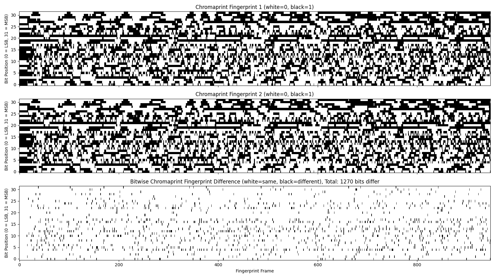

## Chromaprint Fingerprint Difference

Compares [Chromaprint](https://github.com/acoustid/chromaprint) fingerprints of two audio files and generates an image of the difference, in the same fashion as in this blog post: [How does Chromaprint work?](https://oxygene.sk/2011/01/how-does-chromaprint-work/)

### How to build

- Install `uv` (python package manager)
- Install `fpcalc` from Chromaprint and make sure it's in your `$PATH`
- Clone the repository
- Run `uv run main.py`

### How to use

`uv run main.py audio1.wav audio2.wav [plot.png]`
- `audio1.wav` and `audio2.wav` are the audio files to compare
- `plot.png` is optional path where to save the difference image. If it is not specified, the image will be shown in a GUI window instead.